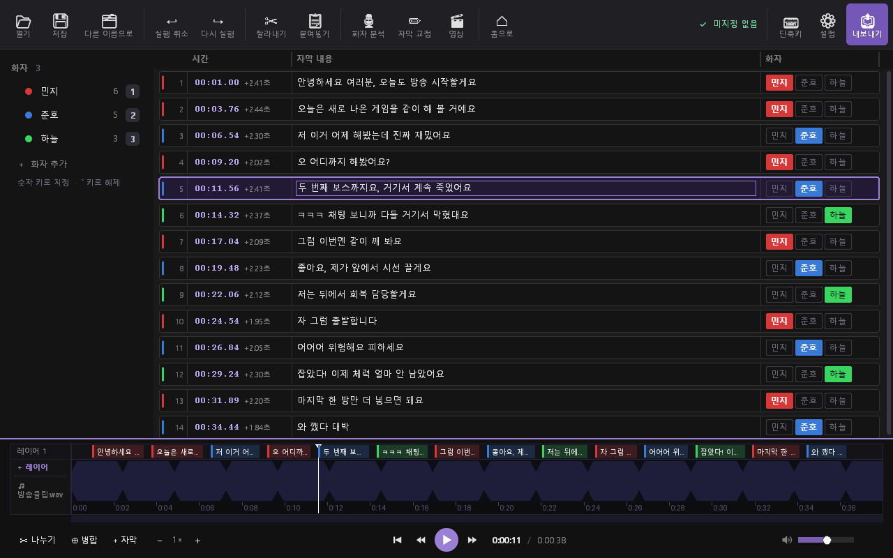

# SRT Speaker Editor

대사마다 화자를 지정해 화자별 SRT로 나누는 Windows용 자막 편집기입니다.



## 주요 기능

- 자막 표와 파형 타임라인에서 텍스트·시간·화자 편집
- Whisper로 음성/영상에서 자막 자동 생성
- 자막 줄마다 목소리를 구분하는 화자 자동 분석 (화자마다 3~5줄을 먼저 지정하면 나머지를 채움, 확신이 낮은 줄은 '확인 필요'로 표시)
- 화자별 `.srt` 내보내기

## 사용 방법

1. SRT 또는 음성/영상 파일을 끌어다 놓거나 `열기`로 엽니다.
2. 화자를 지정합니다. 숫자 키 `1`~`9`로 바로 지정할 수 있습니다.
3. `저장`(`Ctrl+S`) 후 `내보내기`로 화자별 SRT를 만듭니다.

## 테스트

버전을 올리거나 코드를 고친 뒤에는 회귀 테스트로 기능이 그대로 동작하는지 확인합니다. 보이지 않는 별도 데스크톱에서 돌아가서 화면·포커스를 건드리지 않고, 설정·백업·모델 캐시도 임시 폴더를 씁니다.

```
python tests/run_tests.py                 전체 실행 (약 3분)
python tests/run_tests.py --only table.   이름에 'table.'이 들어간 테스트만
python tests/run_tests.py --list          테스트 목록
python tests/run_tests.py --visible -v    일반 화면에서 실행하며 통과 항목도 표시
```

## 참고

- 자동 자막·화자 분석은 처음 쓸 때 AI 부품(whisperx·torch)을 앱과 따로 설치합니다. NVIDIA GPU용 약 7GB, CPU용 약 4GB이며 `%USERPROFILE%\.srt_speaker_editor_ai`에 들어가고, 설정 → 저장 공간에서 지울 수 있습니다.
- 화자 분석에는 HuggingFace 토큰이 필요합니다. [pyannote/speaker-diarization-community-1](https://huggingface.co/pyannote/speaker-diarization-community-1)에서 약관에 동의한 뒤 설정 창에 입력하세요.
- NVIDIA GPU 사용을 권장합니다.
